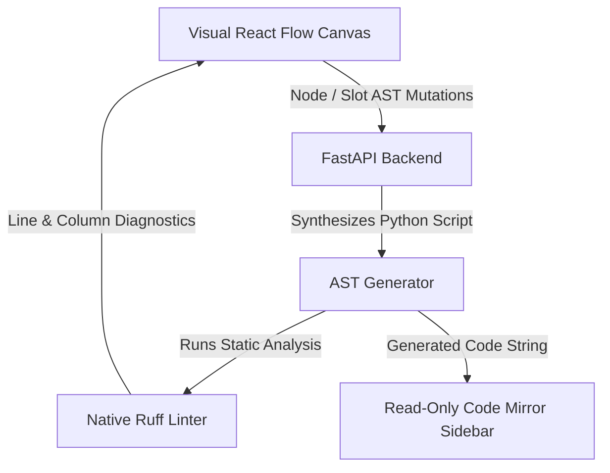

# Graphboard

**Graphboard** is a visual, logic-driven graph editor for building, compiling, and running **LangGraph** workflows in Python.

Instead of writing complex state machine code manually, Graphboard provides a visual canvas where you design logic using connected nodes and simple conditional rules. Graphboard automatically generates clean, executable Python scripts in real time and validates them instantly on the backend.

### 🚀 Project Status & R&D Evolution
This repository serves as a personal, non-commercial full-stack R&D exploration and engineering showcase for full-stack AI system design. It builds directly upon ideas from a previous project (**Mapboard**), introducing two core architectural evolutions:
* **Backend Stack:** Migrated from Nest.js/Node.js to a Python/FastAPI ecosystem.
* **Execution Strategy:** Replaced a custom DAG execution engine with an ongoing, active implementation of a LangGraph-based state machine interpreter.

*This project serves as a showcase of advanced conversational state control, real-time visual-to-code translation layer design, and complex React/FastAPI architecture.*

---

---

## 💡 How It Works

1. **Build Visually**: Arrange execution nodes (Steps, Switches/Decisions, Entry & Exit sentinels) on an auto-layout canvas.
2. **Define Logic via Expressions**: Assign AST expression conditions to decision slots and state updates to step nodes.
3. **Inspect Generated Python Code**: Graphboard deterministically compiles your visual graph into clean Python code using standard `LangGraph` primitive calls (`StateGraph`, `add_node`, `add_conditional_edges`) and `TypedDict` state definitions.
4. **Instant Diagnostic Feedback**: The Python backend executes native `Ruff` static analysis on the generated code, surfacing errors and warnings directly onto visual canvas elements and the CodeMirror sidebar viewer.

---

## 🧩 Visual Node Roles & Code Mapping

| Node Type | Role | Generated Python Representation |
| :--- | :--- | :--- |
| **START** | Entry point of execution flow | Mapped to `START` sentinel: `workflow.add_edge(START, "first_step")` |
| **END** | Exit point / state machine termination | Mapped to `END` sentinel: `workflow.add_edge("last_step", END)` |
| **STEP** | Performs state updates or task execution | Generated Python function registered via `workflow.add_node("step_name", func)` |
| **SWITCH** | Evaluates conditional branching logic | Router function evaluating AST expressions in `if/elif` order, registered via `workflow.add_conditional_edges(...)` |

---

## 📈 Project Progress Tracker (Incremental Phase Backstory)

For AI agents and developers reviewing the codebase history, Graphboard was built across five deliberate architectural phases:

### Phase 1: Core Graph & Layout Foundation
* **Programmatic Auto-Layout**: Configured React Flow to disable manual node dragging (`nodesDraggable: false`) and delegated all positioning calculations to ELK (Eclipse Layout Kernel).
* **Slot-Based Handling**: Implemented output slots on Switch nodes representing execution branches, while Step nodes use node-level input/output handles directly.
* **Detour Back-Edge Routing**: Detected backward execution paths (feedback loops) and routed them manually around the bottom of the graph to avoid distorting ELK layouts.
* **Handles Lifecycle Sync**: Added automatic React Flow handle cache updates via `updateNodeInternals` when slot configurations toggle.
* **Smooth Animation Transitions**: Mapped screen coordinates before history changes to trigger clean sliding animations on undo/redo.

### Phase 2: State & Synchronization Layer
* **FastAPI Backend Port**: Rewrote the server from Node.js/Nest.js to Python/FastAPI.
* **Optimistic Store Sync**: Integrated a Zustand store on the frontend that updates memory instantly, synchronizing with the database asynchronously via TanStack Query.
* **UoW Event Buffering**: Configured a FastAPI Unit of Work (UoW) transaction manager that buffers WebSocket broadcasts until database transactions commit successfully.

### Phase 3: Single-File Code Editor & Bidirectional AST Lock
* **Sidebar Code Inspector**: Integrated CodeMirror 6 with custom syntax highlighting and theme styling.
* **AST-Based Selection & Folding**: Implemented CodeMirror AST syntax tree traversal so selecting visual nodes unfolds and highlights code functions, while clicking code function definitions selects corresponding visual nodes.

### Phase 4: Pure Visual Graph & AST Engine Pivot
* **Pure Graph Source of Truth**: Pivoted graph state (`state_schema`, nodes, slot AST expressions) to be the sole data model. Code becomes a 100% derived read-only view.
* **Deterministic Code Generation**: Backend synthesizes clean Python script from ASTs and graph topology without manual code parsing.
* **Read-Only CodeMirror Guard**: Set `EditorState.readOnly.of(true)` in CodeMirror while preserving AST syntax tree iteration for selection and code folding.

### Phase 5: Native Backend Ruff Diagnostics Engine
* **Backend Ruff Integration**: Replaced heavy browser WASM linters with native `ruff check --output-format=json -` subprocess calls on the Python backend.
* **Canvas Problem Markers**: Surfaced structured line/column diagnostics back to CodeMirror and visual canvas node headers.

---

## 🏗️ Architecture Overview

### Key Technical Choices
* **TanStack Query & Zustand Separation**: TanStack Query manages API mutations, caching, and server state. Zustand acts strictly as a lightweight UI selection store.
* **Auto-Layout ONLY (No Drag-and-Drop)**: Coordinates `(x, y)` are computed on the fly by ELK in two phases: unmeasured initial load and deferred measuring on node dimension resizes.
* **String-Based Identifiers**: Node and slot IDs use human-readable strings (e.g. `"step_1"`, `"option_a"`), matching the execution keys in compiled LangGraph workflows.

---

## 🛠️ Tech Stack

* **Frontend**: React 19, TypeScript, React Flow (@xyflow/react), ELKjs, CodeMirror 6, TanStack Query v5, Zustand, Radix UI.
* **Backend**: Python 3.12+, FastAPI, LangGraph, SQLAlchemy 2.0, Pydantic v2, Ruff.

---

## 📌 Implementation Gotchas & Quirks

* **Handle Lifecycle (`updateNodeInternals`)**: When slots are added or removed dynamically on SWITCH nodes, React Flow's cached handle locations become stale. We listen to `node.slots` changes in `FlowNode.tsx` to trigger `updateNodeInternals(id)` whenever slot structure updates.
* **CodeMirror Read-Only Guard**: Setting `EditorState.readOnly.of(true)` across CodeMirror locks typing while allowing `@codemirror/language` AST syntax tree iteration to continue driving bidirectional node highlighting and code folding.
* **Native Ruff CLI Subprocess**: Running `ruff check` natively on the backend executes in sub-milliseconds, completely eliminating WASM bundle overhead on the frontend.

