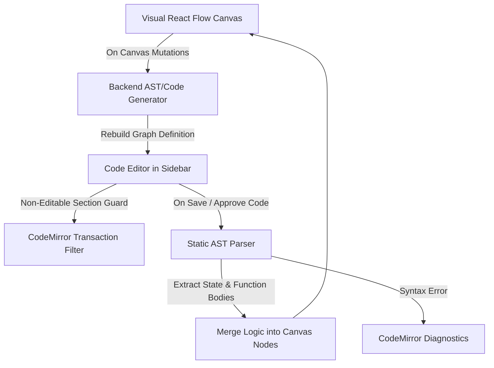

# Graphboard

Graphboard is a code-first, logic-driven graph editor for building, compiling, and visualizing **LangGraph** workflows. Unlike traditional canvas tools, Graphboard keeps visual node arrangements and a single, full-viewport Python script in the sidebar synchronized **bidirectionally** using a static AST compilation engine and a visual-first layout editor.

### Project Status & Evolution
This repository serves as a personal, non-commercial R&D exploration and a continuous playground for full-stack AI system design. It builds upon ideas from a previous project (Mapboard) with two fundamental architectural shifts:
* **Backend Stack:** Migrated from Nest.js/Node.js to a Python/FastAPI ecosystem.
* **Execution Strategy:** Replaced a bespoke, custom DAG execution engine with an ongoing, active implementation of a LangGraph-based state machine interpreter. 

*As an active work-in-progress experiment, this codebase is primarily dedicated to skill acquisition, showcasing advanced conversational state control, and prototyping dynamic graph translation layer concepts.*

---

Below is a screenshot of the AI workflow of a well-known "Who wants to be a millionaire" game.

---

## 1. Core Concept & Visual Node Roles

In Graphboard, agentic logic is structured into visual execution nodes. Each node maps to a corresponding function or sentinel definition inside the single Python script:

### START Node (Entry point)
* **Role**: Defines where the workflow execution begins.
* **Code Representation**: Mapped directly to standard LangGraph sentinels: `workflow.add_edge(START, "first_step")`.

### END Node (Exit point)
* **Role**: Defines transition out of the state machine.
* **Code Representation**: Mapped to the `END` sentinel: `workflow.add_edge("last_step", END)` or `{"yes_route": END}`.

### STEP Node (Sequential Execution)
* **Role**: Represents a task performing updates or calculations.
* **Code Representation**: A python function registered via `workflow.add_node("name", func)`.

### SWITCH Node (Decision & Routing)
* **Role**: Evaluates branching logic to dynamically route control flow to one of several downstream nodes.
* **Code Representation**: A python function returned as a router inside `workflow.add_conditional_edges("name", router_func, path_map)`. The output slots on the SWITCH node represent the keys of the path map.

---

## 2. Project Progress Tracker (Incremental Status)

### Phase 1: Core Graph & Layout Foundation (Implemented)
* **Programmatic Auto-Layout**: Configured React Flow to disable manual node dragging (`nodesDraggable: false`) and delegate all positioning calculations to ELK.
* **Slot-Based Handling**: Implemented output slots on Switch nodes representing execution branches, while Step nodes use node-level input/output handles directly.
* **Detour Back-Edge Routing**: Detected backward execution paths (feedback loops) and routed them manually around the bottom of the graph to avoid distorting ELK layouts.
* **Handles Lifecycle Sync**: Added automatic React Flow handle cache updates via `updateNodeInternals` when slot configurations toggle.
* **Animation Transition Smoothness**: Mapped screen coordinates before history changes to trigger clean sliding animations on undo/redo.

### Phase 2: State & Synchronization Layer (Implemented)
* **FastAPI Backend Port**: Rewrote the server from Node.js/Nest.js to Python/FastAPI.
* **Optimistic Store Sync**: Integrated a Zustand store on the frontend that updates memory instantly, synchronizing with the database asynchronously.
* **UoW Event Buffering**: Configured a FastAPI Unit of Work transaction manager that buffers WebSocket broadcasts until transactions commit successfully.

### Phase 3: Workspace Editor UI (Implemented)
* **Single-File Sidebar Code Editor**: Refactored the left sidebar into a single full-viewport CodeMirror 6 Python editor. All variables, helper functions, and logic nodes are defined in this single file.
* **CodeMirror Edit Locking**: Locked the `# Graph Definition` section at the bottom of the script using a CodeMirror transaction filter. Users modify logic inside functions in the editor, but must use the canvas UI to edit node connections.
* **Approve/Discard Guards**: Added CodeMirror state buffers so users must explicitly approve code changes to sync them to the canvas, or discard to revert.
* **Canvas Interception Prevention**: Disabled global canvas hotkeys when the cursor is focused inside CodeMirror.

### Phase 4: Linter & Diagnostics Engine (Implemented)
* **Backend Validation**: Executes code compilation checks on the backend to flag syntax and import errors, surfacing full tracebacks directly inside the editor's diagnostics panel.
* **Autocompletion**: Integrated autocomplete suggestions inside CodeMirror.

### Phase 5: Code Scaffolding & Static AST Parser (Implemented)
* **Static AST Parser**: Statically scans the Python script on the backend using python's built-in `ast` module to extract TypedDict annotations and function definitions. This completely avoids executing user code (`exec()`) during parsing, ensuring speed and security.
* **Visual-to-Code Generator**: Automatically re-generates the Python script (including imports, State, updated function bodies, and compiled Graph Definitions) whenever connections, slots, or nodes are added/modified visually on the canvas.

---

## 3. Core System Architecture & Design Choices

### Symmetrical Logic Sync Architecture

### Local Zustand Store vs. DB Caching
To keep UI edits latency-free, the frontend updates a local Zustand store in memory and syncs changes asynchronously. The visual `nodes` and `edges` list are cached in the database's `flow_json` to avoid parsing and executing python code on every read.

### Auto-Layout ONLY (No Drag-and-Drop)
React Flow's `nodesDraggable` is set to `false`. Node coordinates `(x, y)` are computed on the fly by ELK in the frontend using node dimensions. Slot edits trigger a debounced (1000ms) ELK recalculation once resizing finishes.

---

## 4. Key Implementation Gotchas

* **CodeMirror Transaction Lock**: We use `EditorState.transactionFilter` inside `FullCodeEditor.tsx` to detect and intercept modifications touching the bottom Graph Definition section (finding `# Graph Definition` string index), blocking the transaction to enforce read-only properties. To allow programmatic updates (like visual slot renaming, node creations, or undo/redo layout updates) to modify this section, we dispatch transactions with a custom `systemUpdate` annotation to bypass the filter.
* **Fault-Tolerant Code Validation**: If the user writes a syntax or parsing error in CodeMirror, the backend rejects the sync payload with a `422 Unprocessable Entity` error. The frontend catches this, displays the traceback in the diagnostics panel, and freezes canvas edits to preserve the last valid visual representation.
* **Unconditional Layout Transitions**: Visual CSS transitions (`transition: transform 400ms...`) are applied statically to node styles in `flowUtils.ts` when elements are mapped. React Flow forwards this to the outer wrapper, animating all coordinate updates.
* **Undo/Redo Animation Trigger**: The history snapshots store final layout positions. If loaded directly, React Flow snaps nodes instantly. To trigger slide animations, `historySlice.ts` maps the *current screen positions* onto the history nodes *before* running ELK. Do not bypass this mapping.
* **Custom Handles Lifecycle & `updateNodeInternals`**: When slots are added or removed, React Flow's DOM-cached registry becomes stale. We must compute a stable `slotsHash` in `FlowNode.tsx` and run a `useEffect` triggering `updateNodeInternals(id)` whenever the hash changes to force React Flow to re-query the handles.
* **String-Based Identifiers (UUID Migration)**: Node, slot, and edge IDs are represented as `string` values instead of strict `uuid.UUID` types. This enables user-friendly, readable node names (like `"step_1"`) and slot names (like `"switch_1_option_a"`) to serve directly as the execution keys in the compiled LangGraph workflow.

