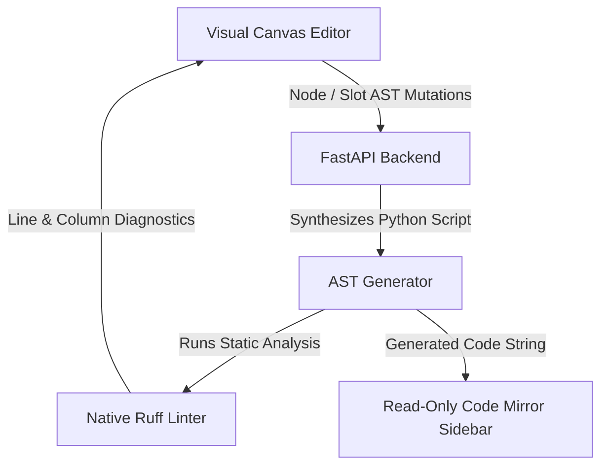

# Graphboard

**Graphboard** is a visual, graph-oriented editor for designing, compiling, and running **LangGraph** workflows in Python.

Instead of writing executable code by hand, you construct your agentic logic visually using nodes, state schemas, and expression slots. Graphboard automatically synthesizes clean, executable Python code in real time and validates it on the fly.

---

---

## 💡 How It Works

1. **Build Visually**: Arrange nodes (Steps, Decisions/Switches, Entry & Exit points) on an auto-layout canvas.
2. **Define Logic via Expressions**: Assign AST expression conditions to decision slots and state updates to action nodes.
3. **Inspect Generated Python Code**: Graphboard deterministically compiles your visual graph into executable Python code (using standard `LangGraph` primitive calls and `TypedDict` state definitions).
4. **Instant Linting**: The Python backend runs native `Ruff` static analysis on the generated code to surface errors and warnings directly back onto the visual canvas and sidebar code viewer.

---

## 🧩 Visual Node Types

| Node Type | Role | Generated Python Representation |
| :--- | :--- | :--- |
| **START** | Entry point of execution flow | Mapped to `START` sentinel: `workflow.add_edge(START, "first_step")` |
| **END** | Exit point / state machine termination | Mapped to `END` sentinel: `workflow.add_edge("last_step", END)` |
| **STEP** | Performs state updates / calculations | Generated Python function registered via `workflow.add_node("step_name", func)` |
| **SWITCH** | Evaluates conditional branching logic | Router function evaluating expressions in `if/elif` order registered via `workflow.add_conditional_edges(...)` |

---

## 🏗️ Architecture Overview

Graphboard operates as a reactive web application driven by a Python FastAPI backend and a React Flow frontend:

### Key Technical Choices
* **Pure Visual Graph Model**: The visual graph (nodes, slots, edges, state schema) is the single source of truth. Code is strictly a generated output.
* **Deterministic Layout (ELK)**: Manual node dragging is disabled (`nodesDraggable: false`). Layout is computed automatically by ELK (Eclipse Layout Kernel) on the frontend for consistent, clean diagramming.
* **Synchronized Code Inspector**: Clicking a visual node automatically highlights and unfolds its generated function in the CodeMirror sidebar, while clicking a function in the code editor highlights its visual node on the canvas.
* **Optimistic Updates & Unit of Work**: Uses TanStack Query for data fetching, Zustand for UI selection markers, and a FastAPI Unit of Work transaction manager to buffer WebSocket events until DB commits finish.

---

## 🛠️ Tech Stack

* **Frontend**: React 19, TypeScript, React Flow (@xyflow/react), CodeMirror 6, TanStack Query, Zustand, Radix UI.
* **Backend**: Python 3.12+, FastAPI, SQLAlchemy 2.0, Pydantic v2, Ruff (for code linting & formatting), LangGraph.

---

## 📌 Implementation Gotchas & Quirks

* **Handle Lifecycle (`updateNodeInternals`)**: When slots are added or removed dynamically on SWITCH nodes, React Flow's cached handle locations can become stale. We use a computed `slotsHash` in `FlowNode.tsx` to call `updateNodeInternals(id)` whenever slots change.
* **String Identifiers**: Node and slot IDs use readable string names (e.g. `"step_1"`, `"option_a"`) rather than raw UUIDs, matching the function names and branch keys in the generated LangGraph workflow.
* **Read-Only CodeMirror Guard**: `EditorState.readOnly.of(true)` locks CodeMirror edits while keeping full syntax tree parsing enabled for bidirectional selection and code folding.

