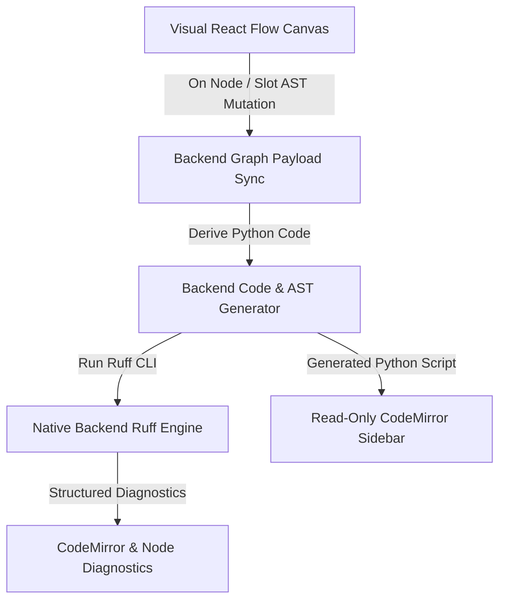

# Graphboard

Graphboard is a pure visual, logic-driven graph editor for building, compiling, and visualizing **LangGraph** workflows. Visual node arrangements, slot AST expressions, and state schemas serve as the single source of truth, from which full Python scripts are deterministically generated and displayed in a read-only sidebar preview.

### Project Status & Evolution
This repository serves as a personal, non-commercial R&D exploration and a continuous playground for full-stack AI system design. It builds upon ideas from a previous project (Mapboard) with two fundamental architectural shifts:
* **Backend Stack:** Migrated from Nest.js/Node.js to a Python/FastAPI ecosystem.
* **Pure Visual Graph Architecture:** Pivoted from bidirectional code editing to a pure graph-oriented model where code is non-editable, automatically generated, and validated via backend Ruff diagnostics.

*As an active work-in-progress experiment, this codebase is primarily dedicated to skill acquisition, showcasing advanced conversational state control, and prototyping dynamic graph translation layer concepts.*

---

Below is a screenshot of the AI workflow of a well-known "Who wants to be a millionaire" game.

---

## 1. Core Concept & Visual Node Roles

In Graphboard, agentic logic is structured into visual execution nodes. Each node maps to generated Python code and LangGraph constructs:

### START Node (Entry point)
* **Role**: Defines where the workflow execution begins.
* **Code Representation**: Mapped directly to standard LangGraph sentinels: `workflow.add_edge(START, "first_step")`.

### END Node (Exit point)
* **Role**: Defines transition out of the state machine.
* **Code Representation**: Mapped to the `END` sentinel: `workflow.add_edge("last_step", END)` or `{"yes_route": END}`.

### STEP Node (Sequential Execution)
* **Role**: Represents a task performing updates or state calculations.
* **Code Representation**: A generated python function returning state mutation dicts, registered via `workflow.add_node("name", func)`.

### SWITCH Node (Decision & Routing)
* **Role**: Evaluates slot AST condition expressions to dynamically route control flow.
* **Code Representation**: A generated router function evaluating slot AST expressions in `if/elif` order, registered via `workflow.add_conditional_edges("name", router_func, path_map)`.

---

## 2. Project Progress Tracker (Incremental Status)

### Phase 1: Core Graph & Layout Foundation (Implemented)
* **Programmatic Auto-Layout**: Configured React Flow to disable manual node dragging (`nodesDraggable: false`) and delegate all positioning calculations to ELK.
* **Slot-Based Handling**: Implemented output slots on Switch nodes representing execution branches, while Step nodes use node-level input/output handles directly.
* **Detour Back-Edge Routing**: Detected backward execution paths (feedback loops) and routed them manually around the bottom of the graph to avoid distorting ELK layouts.
* **Handles Lifecycle Sync**: Added automatic React Flow handle cache updates via `updateNodeInternals` when slot configurations toggle.
* **Animation Transition Smoothness**: Mapped screen coordinates before history changes to trigger clean sliding animations on undo/redo.

### Phase 2: State & Synchronization Layer (Implemented)
* **FastAPI Backend Port**: Rewrote the server from Node.js/Nest.js to Python/FastAPI.
* **Optimistic Store Sync**: Integrated a Zustand store on the frontend that updates memory instantly, synchronizing with the database asynchronously.
* **UoW Event Buffering**: Configured a FastAPI Unit of Work transaction manager that buffers WebSocket broadcasts until transactions commit successfully.

### Phase 3: Pure Visual Graph & AST Engine (Implemented)
* **Pure Graph Source of Truth**: Graph schema (`state_schema`, nodes, slot AST expressions) is the sole data representation. Manual code editing is disabled.
* **Deterministic Code Generation**: Python code is dynamically synthesized on the backend from ASTs and graph topology.
* **Read-Only CodeMirror Sidebar**: Displays the generated Python script in read-only mode with active syntax highlighting.
* **Bidirectional AST Selection & Folding**: Retained CodeMirror AST syntax tree traversal so selecting canvas nodes unfolds and highlights code functions, and clicking code function definitions selects corresponding visual nodes.

### Phase 4: Native Backend Ruff Engine (Implemented)
* **Backend Ruff Diagnostic Checks**: Executes `ruff check --output-format=json -` natively on the backend against generated Python code.
* **Frontend Diagnostics Display**: Surfacing Ruff diagnostics directly in CodeMirror and canvas problem indicators without needing browser WASM binaries.

---

## 3. Core System Architecture & Design Choices

### Dynamic Graph-to-Code Pipeline

### TanStack Query Cache & Lightweight Zustand Store
Graphboard uses **TanStack Query** to drive server synchronizations, data cache invalidations, and mutations, while **Zustand** is kept as a lightweight UI store.
* **TanStack Query**:
  * `useGraphQuery(graphId)`: Fetches raw, un-laid-out graph structure from the server. Deduplicated across all child components (nodes, slots, editor).
  * `useLaidOutGraph(graphId)`: Exclusively executed once at the canvas root to manage layout coordinates, initial measuring phases, and slot count updates.
  * `useGraphMutations(graphId)`: Mutates structural nodes, edges, slots, and updates the local CodeMirror editor buffer on success.
* **Zustand Store**:
  * Manages UI selection markers (`selectedNodeId`, `selectedSlotId`) and active diagnostics.
  * Selection state is reactively stitched into mapped React Flow nodes inside `useLaidOutGraph` to skip running ELK layout calculations on selection toggles.

### Auto-Layout ONLY (No Drag-and-Drop)
React Flow's `nodesDraggable` is set to `false`. Node coordinates `(x, y)` are computed on the fly by ELK in the frontend. Layout changes are performed in two phases:
1. **Initial Load**: Graph renders nodes unmeasured. Once `nodes.every(n => n.measured)` is met, ELK runs layout exactly **once** and sets `isLoading` to false.
2. **Pending Mutations**: Slot modifications flag the target node's dimensions as pending. Layout is deferred until the new slot dimensions are measured.

---

## 4. Key Implementation Gotchas

* **CodeMirror Read-Only Guard**: Set `EditorState.readOnly.of(true)` across the entire CodeMirror state in `useCodeMirror.ts` to enforce read-only properties while preserving AST syntax tree iteration for bidirectional selection and code folding.
* **Native Ruff Diagnostics Integration**: Diagnostics are generated natively on the backend via Python `subprocess` calling `ruff check`, eliminating the heavy `@astral-sh/ruff-wasm-web` browser bundle.
* **Unconditional Layout Transitions**: Visual CSS transitions (`transition: transform 400ms...`) are applied statically to node styles when elements are mapped. React Flow forwards this to the outer wrapper, animating all coordinate updates.
* **Custom Handles Lifecycle & `updateNodeInternals`**: When slots are added or removed, React Flow's DOM-cached registry becomes stale. We must compute a stable `slotsHash` in `FlowNode.tsx` and run a `useEffect` triggering `updateNodeInternals(id)` whenever the hash changes to force React Flow to re-query the handles.
* **String-Based Identifiers (UUID Migration)**: Node, slot, and edge IDs are represented as `string` values instead of strict `uuid.UUID` types. This enables user-friendly, readable node names (like `"step_1"`) and slot names (like `"switch_1_option_a"`) to serve directly as the execution keys in the compiled LangGraph workflow.

